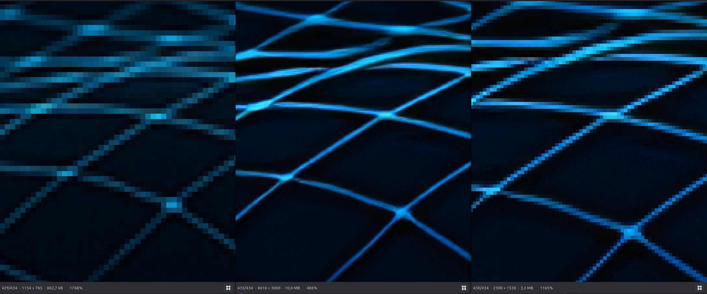

# pixctl

Lightweight local AI image upscaler — no accounts, no cloud, no telemetry.

Gradio web UI for upscaling, compression, format conversion, and metadata stripping, powered by [Real-ESRGAN](https://github.com/xinntao/Real-ESRGAN). Runs entirely on your machine.

> **Real-ESRGAN is not bundled.** You must install an external backend (ncnn-vulkan binary or Python script) and point pixctl at it. See [docs/REAL_ESRGAN_SETUP.md](docs/REAL_ESRGAN_SETUP.md).

---

## Demo

[](https://youtu.be/I6z3NQbGmj8)

[Watch on YouTube →](https://youtu.be/I6z3NQbGmj8)

---

## Screenshots


<table>
<tr>
<td></td>
<td></td>
</tr>
</table>

---

## Features

**Upscale** *(requires Real-ESRGAN backend)*
- 2× and 4× AI upscaling
- Models: `realesrgan-x4plus`, `realesrgan-x4plus-anime`, `realesr-animevideov3`
- Output formats: PNG, JPEG, WebP
- Optional face enhancement (Python script backend only)
- Optional auto-compress pass after upscaling

**Compress / Resize** *(no backend required)*
- Format conversion: JPEG, PNG, WebP
- Quality slider (1–100)
- Max-width presets: 1280, 1920, 2560, 3840 px
- Target file size presets: 1 MB, 2 MB, 5 MB, 10 MB
- EXIF and metadata stripping

**Batch Folder Mode** — UI skeleton present; processing logic not yet implemented.

---

## Requirements

- Python 3.9+
- A Real-ESRGAN backend (ncnn-vulkan binary or `inference_realesrgan.py` Python script)

Python dependencies (`gradio`, `Pillow`) are installed automatically by `start.sh`.

---

## Quick Start

```bash
git clone <repo-url> pixctl
cd pixctl
./start.sh
```

Opens at **http://127.0.0.1:7860** (auto-increments port if busy).

`start.sh` creates `.venv`, installs dependencies from `requirements.txt`, and launches the app. Manual setup:

```bash
python3 -m venv .venv
source .venv/bin/activate
pip install -r requirements.txt
python app.py
```

---

## Real-ESRGAN Backend

pixctl auto-detects a backend at startup in this order:

| Priority | Location | Kind |
|----------|-----------|------|
| 0 | `$REAL_ESRGAN_PATH` env var | auto-detected |
| 1 | `realesrgan-ncnn-vulkan` in `$PATH` | ncnn-vulkan binary |
| 2 | `./realesrgan-ncnn-vulkan` | ncnn-vulkan binary |
| 3 | `./Real-ESRGAN/realesrgan-ncnn-vulkan` | ncnn-vulkan binary |
| 4 | `./Real-ESRGAN/inference_realesrgan.py` | Python script |

If no backend is found the Upscale tab loads but Run is disabled. The path can also be set directly in the UI.

Full setup instructions: [docs/REAL_ESRGAN_SETUP.md](docs/REAL_ESRGAN_SETUP.md)

---

## Configuration

| Variable | Effect |
|---|---|
| `PIXCTL_PORT=7865` | Start on a specific port |
| `PIXCTL_OPEN_BROWSER=0` | Disable auto browser-open |
| `PIXCTL_DEBUG=1` | Print backend detection, subprocess args, stdout/stderr |

---

## Output Structure

```
outputs/
  upscaled/     ← Upscale tab results
  compressed/   ← Compress / Resize tab results
  batch/        ← Batch tab results (placeholder)
temp/           ← Transient working files (cleared on startup)
```

---

## Docs

- [docs/HOWTO.md](docs/HOWTO.md) — step-by-step usage guide
- [docs/REAL_ESRGAN_SETUP.md](docs/REAL_ESRGAN_SETUP.md) — backend installation
- [docs/TROUBLESHOOTING.md](docs/TROUBLESHOOTING.md) — common problems and fixes
- [CHANGELOG.md](CHANGELOG.md) — release history
- [CONTRIBUTING.md](CONTRIBUTING.md) — local setup and PR rules
- [SECURITY.md](SECURITY.md) — vulnerability reporting and Gradio network notes

---

## License

MIT — see [LICENSE](LICENSE).

---

<sub>Development orchestrated with RailTaskLite.</sub>
